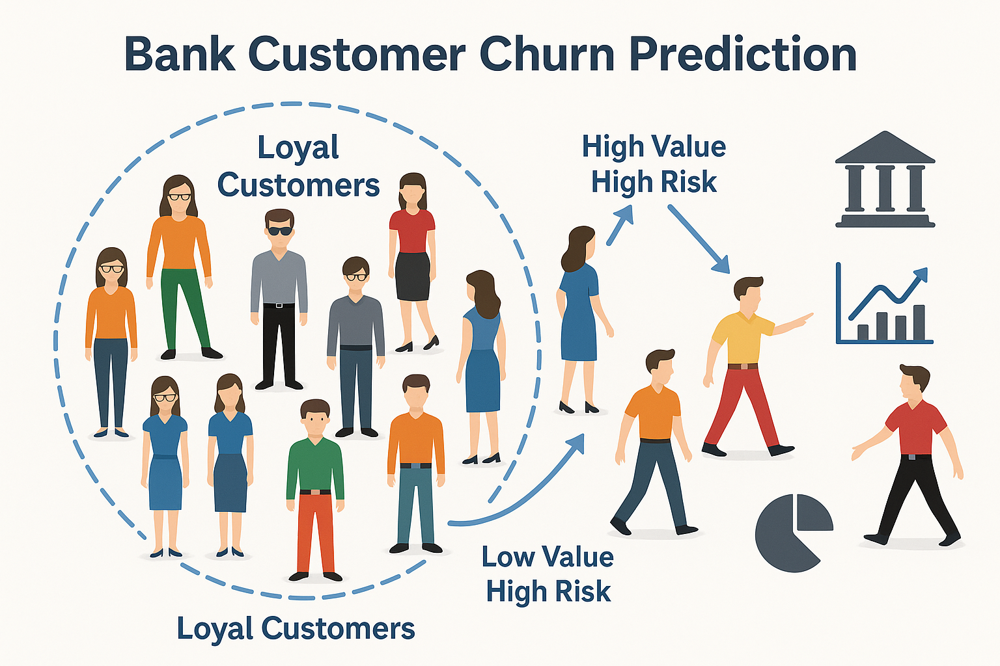

# Customer Churn Prediction  
**Edunet Foundation AICTE Internship : Foundations of AI**

## Internship Task Description  

**TASK : CUSTOMER CHURN PREDICTION**  
Develop a model to predict customer churn for a bank , subscription-based service or business. Use historical customer data, including features like usage behavior and customer demographics. Try algorithms like Logistic Regression, Random Forests etc to predict churn.



---

## Project: Predicting Customer Churn in the Banking Sector

### Problem Statement  
Customer attrition, or churn, is a significant challenge for banks and businesses , directly impacting revenue and growth. Retaining existing customers is more cost-effective than acquiring new ones. Therefore, predicting which customers are likely to leave allows banks to develop proactive strategies for retention.

This project aims to predict customer churn based on customer demographics and account-related behavior. By identifying high-risk customers, the bank can target retention efforts more effectively.

---

### Objective  
To develop a supervised classification model that can accurately predict whether a customer will churn or stay with the bank, using historical data of customer demographics, credit scores, and account-related behavior.

---

### Dataset Overview  

- **Industry**: Banking / Financial Services   
- **Total Records**: Approximately 10,000 customers  
- **Target Variable**: `Exited` (1 = Churned, 0 = Retained)  
- **Features**:
  - `RowNumber`: Row number of the dataset
  - `CustomerId`: Unique identifier for each customer
  - `Surname`: Surname of the customer
  - `CreditScore`: Credit score of the customer
  - `Geography`: Location of the customer (e.g., country)
  - `Gender`: Gender of the customer (Male/Female)
  - `Age`: Age of the customer
  - `Tenure`: Number of years the customer has been with the bank
  - `Balance`: Average balance of the customer
  - `NumOfProducts`: Number of bank products the customer is using
  - `HasCrCard`: Whether the customer has a credit card (1 = Yes, 0 = No)
  - `IsActiveMember`: Whether the customer is an active member (1 = Yes, 0 = No)
  - `EstimatedSalary`: Estimated salary of the customer

---

### Tools and Technologies  

| Category            | Tools / Technologies                                    |
|---------------------|---------------------------------------------------------|
| Programming Language| Python                                                  |
| Data Manipulation   | Pandas, NumPy                                           |
| Data Visualization  | Matplotlib, Seaborn                                     |
| Modeling Algorithms | Logistic Regression, Random Forests, or Boosting        |
| Evaluation Metrics  | Accuracy, Precision, Recall, F1-Score, ROC-AUC          |
| Environment         | Jupyter Notebook / Python Scripts                       |

---

### STAR Methodology  

**Situation**  
A bank is experiencing a high level of customer churn, which negatively affects its profitability and growth. The bank needs a predictive model to identify customers at risk of leaving.

**Task**  
Analyze customer data and build a machine learning model to predict whether a customer will churn or not, based on demographic and financial features.

**Action**  
- Conducted exploratory data analysis (EDA) to identify patterns and relationships between features and the target variable.
- Preprocessed data by handling missing values, encoding categorical variables, and scaling numerical features.
- Trained multiple classification models including Logistic Regression, Random Forest, and XGBoost.
- Used performance metrics such as Accuracy, Precision, Recall, F1-Score, and ROC-AUC to evaluate model performance.
- Interpreted the results to identify key factors contributing to customer churn.

**Result**  
The churn prediction model achieved strong performance, with the most important features identified as `CreditScore`, `Age`, and `Balance`. These insights can be used to focus retention efforts on customers with the highest likelihood of leaving the bank.

---

### Key Insights  

- The dataset contains a mix of demographic and financial features that influence customer churn.
- Key features such as `CreditScore`, `Balance`, and `Age` were identified as important predictors for churn.
- The model's performance varied with different algorithms, with XGBoost delivering the best results.

---

### Future Enhancements  

- Deploy the model using a web framework such as Flask or Streamlit for real-time prediction.
- Automate the model deployment and monitoring pipeline using tools like MLFlow or DVC.

---

## How to Clone and Set Up This Project

### Step 1: Clone Rashmi's Repository

If you'd like to clone **RashmiKumari03's** repository and set it up as your own, follow these steps:

#### 1.1 Clone the Repository

Open your terminal/command prompt and run the following command to clone Rashmi's repository:

```bash
git clone https://github.com/rashmiKumari03/Customer_Churn_Prediction.git
```

This will create a local copy of the repository on your machine.

---

### Step 2: Create a New GitHub Repository for Your Project

#### 2.1 Go to [GitHub](https://github.com)
- Create a new repository under **your GitHub account**. You can name it something like `customer-churn-prediction`.

---

### Step 3: Reinitialize the Git Repository

#### 3.1 Navigate to the Cloned Repository

After cloning Rashmi's repo, go to the folder where the repository is saved on your local machine:

```bash
cd Customer_Churn_Prediction
```

#### 3.2 Remove Old Git History and Initialize New Git

Now, remove the old Git history and initialize the repository with your own GitHub repository:

```bash
rm -rf .git           # Removes existing Git history
git init              # Initializes a new Git repository
```

---

### Step 4: Link to Your New GitHub Repository

#### 4.1 Set the Remote to Your Repository

Replace **`yourusername`** with your GitHub username in the URL, and run:

```bash
git remote add origin https://github.com/yourusername/customer-churn-prediction.git
```

For example, if your GitHub username is **johnDoe**, the command would be:

```bash
git remote add origin https://github.com/johnDoe/customer-churn-prediction.git
```

---

### Step 5: Add, Commit, and Push to Your Repository

#### 5.1 Add Files to Git

Stage all files for commit:

```bash
git add .
```

#### 5.2 Commit Your Changes

Commit the files with a message:

```bash
git commit -m "Initial commit - Customer_Churn_Prediction"
```

#### 5.3 Push to Your GitHub Repository

Push the committed files to your newly created GitHub repository:

```bash
git branch -M main    # Rename the default branch to 'main'
git push -u origin main # Push the files to GitHub
```

---

### Step 6: Set Up the Environment

#### 6.1 Create a Conda Environment

Create a new **conda** environment for the project:

```bash
conda create -p venv_churn_prediction python=3.10 -y
```

Activate the environment:

```bash
conda activate ./venv_churn_prediction
```

#### 6.2 Install Dependencies

Install all the required dependencies listed in `requirements.txt`:

```bash
pip install -r requirements.txt
```

---

### Step 7: Run the Project

Now, you're ready to run the project!

- **If you're using a Jupyter Notebook**:

  ```bash
  jupyter notebook
  ```

- **If you're running a Python script**:

  ```bash
  python main.py
  ```

---

.